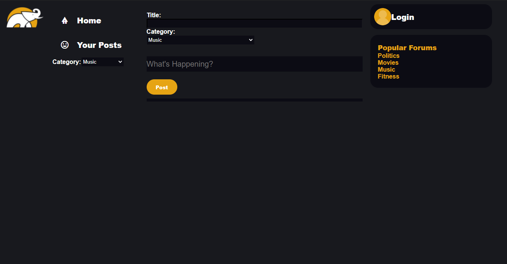
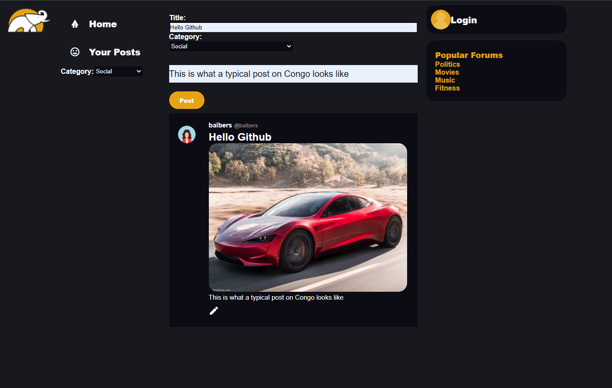
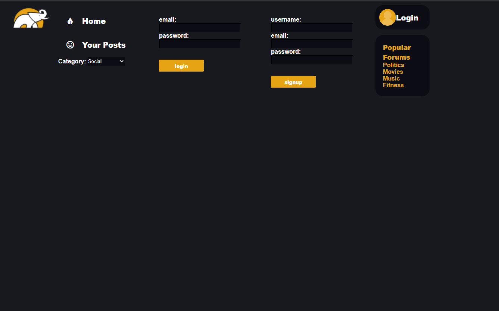
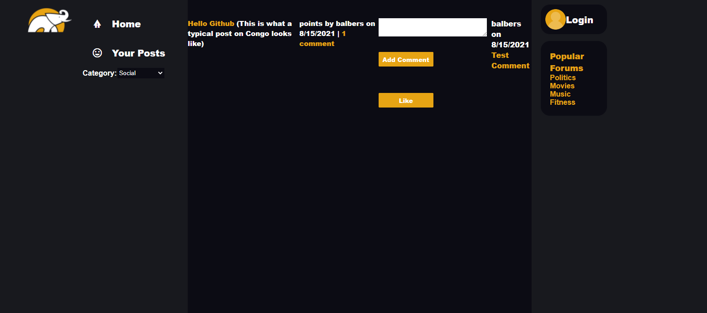

# Congo
  # Table of Contents:
  * [Description](#description)
  * [Screenshots](#screenshots)
  * [Credits](#credits)
  * [Built with](#builtwith)
  * [License](#license)
  * [Email](#email)
  * [GitHub](#github)

# Description 
As social media users, we wanted to create an app that was simple and easy to maneuver that would allow you to filter out posts by category, so that people can search and post based on their interests.

# Screenshots

## Home (w/o posts)

## Home

## Login

## Your Posts

## Edit Posts

## Comments

# Credits 
Created By:

* [Alan Moreno](https://github.com/algmoreno)
* [Bryce Sitler](https://github.com/blanden-hub)
* [Brent Albers](https://github.com/BA1bers)

# License
This project is copyrighted under the 

[MIT License](https://opensource.org/licenses/MIT)

# Email
Have any questions? feel free to email us at 

# GitHub
Follow me on github where you can also ask us questions here at 

https://github.com/algmoreno,
https://github.com/blanden-hub,
https://github.com/BA1bers.
